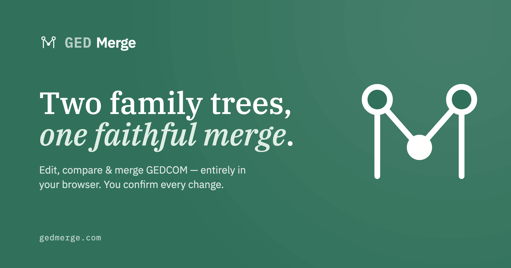
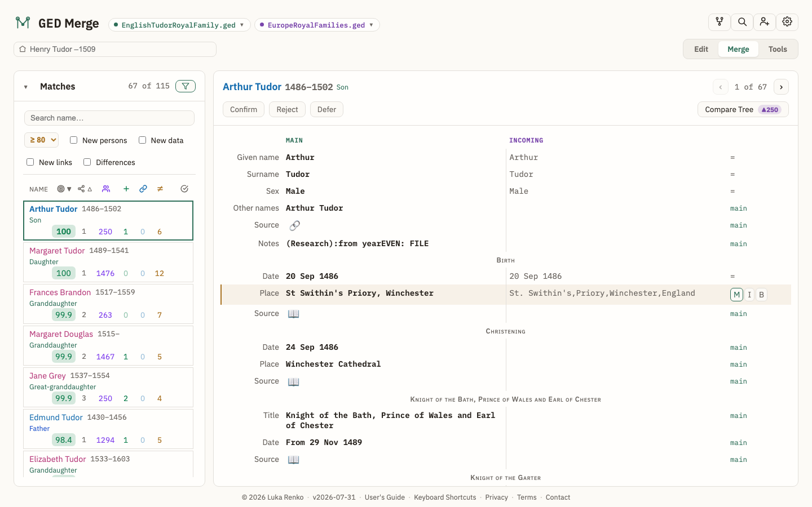
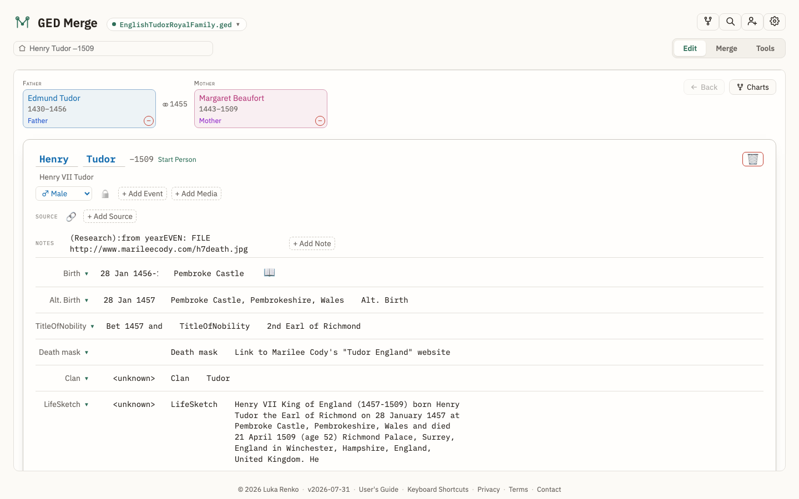
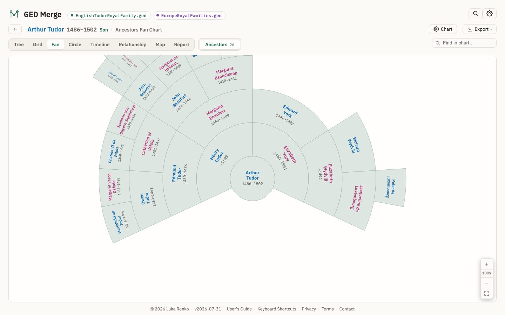

<p align="center">
  
</p>

<h1 align="center">GED Merge</h1>

<p align="center">
  A complete <strong>GEDCOM editor</strong> that runs entirely in your browser.<br>
  Edit your family tree, merge a second file into it field by field, and keep the whole file healthy.
</p>

<p align="center">
  <a href="https://gedmerge.com"></a>
  <a href="https://github.com/rodoslovje/ged-merge/actions/workflows/ci.yml"></a>
  <a href="LICENSE.md"></a>
  
</p>

---

Genealogy programs export GEDCOM, but they merge it badly: import a cousin's file and you get
duplicate people, two spellings of every village, and dates in a format your file has never used.
GED Merge does the opposite — it reshapes the incoming file into *your* file's conventions, scores
every candidate pair, and then shows you both sides of every field so **you** decide what survives.
Nothing is uploaded, and nothing changes until you say so.

- **Live app:** <https://gedmerge.com> — no account, no install, works offline once loaded
- **User's Guide:** <https://gedmerge.com/guide/> · Slovenščina: <https://gedmerge.com/navodila/>
- **Changelog:** <https://gedmerge.com/changelog/> · Slovenščina: <https://gedmerge.com/posodobitve/>
- **Privacy:** <https://gedmerge.com/privacy/> · **Terms:** <https://gedmerge.com/terms/>

> This README is for **developers**. For how to *use* the app, read the User's Guide above.

## What it looks like

**Merge** — the scored candidate list, and one row per field with the main file on the left, the
incoming file on the right, and a Main / Incoming / Both choice wherever they disagree:



**Edit** — a full editor for the loaded file: names, events, families, notes, sources and media:



**Charts** — tree, grid, fan, circle, timeline, relationship path, map and printable reports:



## Features

**Edit** — every record in the file: names and alternate names, events and attributes, families and
relationships, notes, sources and citations, media with crop tagging, and privacy flags. Unified
undo/redo across edits and merge decisions.

**Merge** — load a second GEDCOM (or a [indeks.rodoslovje.si](https://indeks.rodoslovje.si) matches
CSV), get scored candidate pairs ranked by kinship distance from a start person, and resolve each
one field by field. The incoming file is normalized to your file's house style first — date format,
place layout, link languages, GEDCOM version — so you are comparing like with like. Saving produces
a merged file plus a human-readable change report.

**Tools** — whole-file maintenance: a health check, a within-file duplicate finder with clustering,
bulk normalization, a privacy redactor, and source and place browsers with geocoding.

**Charts, maps and reports** — eight views of the same tree, all exportable (SVG, PNG, PDF, and PDF
split across several sheets for a wall-sized chart), plus Ahnentafel and NGSQ register reports in
list or narrative form.

**Faithful to your file** — the parser keeps a lossless line tree, so tags GED Merge does not
understand still round-trip unchanged. Vendor tags from the major programs are recognized rather
than discarded.

**Bilingual** — the entire interface, guide and changelog exist in English and Slovenian.

## Privacy

Your GEDCOM file is never uploaded: parsing, matching, merging, editing, the charts and every tool
run on your own device, and the site has no upload endpoint and no API. Two features make network
requests, both **off by default** and both switched on by you:

- **Online lookups** — a place name, a house number or a source URL sent to OpenStreetMap, the GURS
  registers, GOV, or a public CORS relay.
- **Base-map tiles** — the map background, which tells the tile provider roughly where you are
  looking. Off, maps draw on a bundled offline world outline.

There is no account, no analytics, no third-party script and no tracking cookie; the fonts are
self-hosted. The [Privacy Policy](https://gedmerge.com/privacy/) names every provider, says what is
sent, and lists what the app stores in your browser.

## Getting started

Prerequisites: a recent **Node.js** (ships with npm).

```bash
npm install      # install dependencies
npm run dev      # start the Vite dev server, then open the printed localhost URL
```

There is nothing else to configure — no environment variables, no services, no database. Drop one
of the files in [`public/samples/`](public/samples) (royal families, US presidents) onto the landing
page to try it without your own data.

## Scripts

| Command | What it does |
|---------|--------------|
| `npm run dev` | Start the Vite dev server. |
| `npm run build` | Type-check (`tsc -b`) **and** produce the production bundle in `dist/`. |
| `npm run preview` | Serve the built `dist/` locally. |
| `npm run typecheck` | `tsc -b --noEmit`. Note: incremental build caching can make this a no-op — prefer `npm run build` (or `tsc -b --force`) for a guaranteed full type-check. |
| `npm run lint` | ESLint with `--max-warnings 0`. |
| `npm run test` | Run the Vitest unit tests once. |
| `npm run test:watch` | Vitest in watch mode. |
| `npm run test:coverage` | Unit tests with the per-directory coverage floors CI enforces. |
| `npm run test:e2e` | Run the Playwright end-to-end tests. |

Run a single unit test file:

```bash
npx vitest run src/gedcom/date.test.ts
```

## Architecture

A browser-only React app. All data stays local.

- **Data model** (`src/gedcom/types.ts`) — two layers: a lossless raw line tree (`GedNode`,
  level/tag/value/children, so nothing is dropped on save) and a typed domain model
  (`Individual`, `Family`, `Dataset`) projected on top for matching and the UI.
- **Web Worker** (`src/worker/`) — owns the parse → normalize → match pipeline off the main
  thread, communicating via typed messages.
- **Normalize** (`src/normalize/`) — reshapes an incoming file to the main file's date/place/link
  "house style" before comparison.
- **Match** (`src/match/`) — scores candidate pairs 0–100 over weighted fields, and ranks them by
  kinship distance from a chosen home person.
- **Merge** (`src/merge/`) — applies per-field decisions to produce a merged `GedNode[]` plus a
  change report.
- **Tools** (`src/tools/`) — whole-file maintenance (validation, duplicate finder, bulk normalize,
  sources, places) as pure functions.
- **Chart / report / geo** (`src/chart/`, `src/report/`, `src/geo/`) — pure layout, text and
  gazetteer logic with no React in it.
- **UI** (`src/ui/`) — React components. App state lives in `src/App.tsx`.

The build is **multi-page**: the app (`index.html`) plus the static, crawlable guide, changelog and
legal pages (`guide/`, `navodila/`, `changelog/`, `posodobitve/`, `privacy/`, `zasebnost/`,
`terms/`, `pogoji/`).

**Browser support:** any current browser. Chrome and Edge additionally get the File System Access
API features — a remembered media folder and reopening the file you loaded — where Firefox and
Safari use an in-memory fallback.

### Further reading

| Document | What's in it |
|----------|--------------|
| [CLAUDE.md](CLAUDE.md) | Full module map, development workflow, and the CSS token/styling conventions. |
| [MATCHING.md](MATCHING.md) | The matching algorithm: pipeline stages, weights, gates, penalties, calibrated thresholds, and how to verify a change to any of them. |
| [MAPVIEW.md](MAPVIEW.md) | Map and geocoding design — providers, caching, the coordinate write-back. |
| [IDEAS.md](IDEAS.md) | The backlog: what might come next, and what was deliberately rejected. |

## Contributing

Issues and pull requests are welcome — bug reports especially, since GEDCOM files in the wild vary
far more than any test corpus. A GEDCOM snippet that reproduces the problem is worth more than a
description, but please **redact it first** (the app's Tools › Privacy does this) — do not attach a
file containing living people.

Before opening a PR:

```bash
npm run build && npm run lint && npm run test && npm run test:e2e
```

CI runs lint, typecheck, the unit suite with coverage floors, and the Playwright suite on every
pull request. Two house rules worth knowing: user-facing strings change in **both** `src/locales/en.ts`
and `src/locales/sl.ts` in the same commit, and colours and radii come from the design tokens in
`src/theme/heritage-pine.css` rather than literals. `CLAUDE.md` has the rest.

Regenerate the screenshots above after a UI change with `node scripts/screenshots.mjs` (with the
dev server running).

## Data sources and credits

The optional online features build on public services, each under its own terms: OpenStreetMap and
Nominatim, Overpass, GeoNames, the [GOV](https://gov.genealogy.net/) genealogical gazetteer,
Slovenia's [GURS](https://www.e-prostor.gov.si/) registers and map services, and the CARTO,
OpenTopoMap, Esri, swisstopo and IGN France tile services. Historical map overlays come from the
David Rumsey Map Collection and national mapping agencies. Typeset in IBM Plex.

## License

[MIT](LICENSE.md) © Luka Renko. You may use, modify and redistribute the code, including
commercially. The GED Merge name and logo are not covered by that grant — see the
[Terms](https://gedmerge.com/terms/).

## Build & deploy

```bash
npm run build    # → dist/ : a self-contained static site
```

`dist/` can be hosted on any static file server (the live site runs on Caddy behind Cloudflare;
GitHub Pages, Netlify or Vercel work equally well). The app is an installable PWA and works offline
after the first load.
